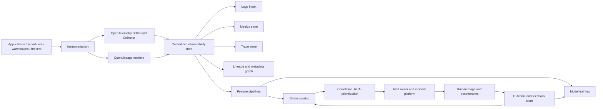
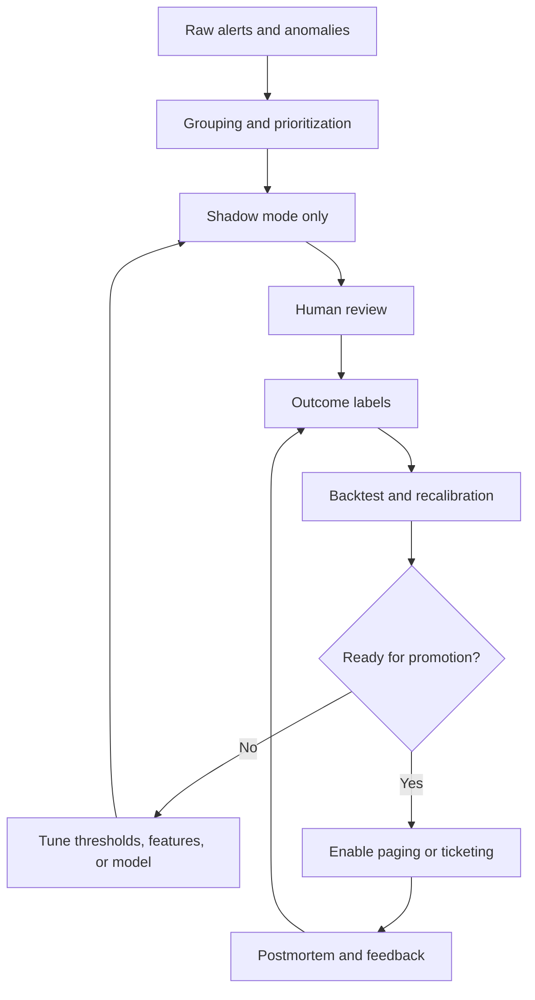

# AI for Pipeline Observability

## Executive Summary

AI for pipeline observability works best as an investigation and triage layer built on top of strong telemetry, lineage, and metadata. The foundation is standardized logs, metrics, traces, and context propagation from combined with job, run, and dataset metadata from Without those join keys, “AI observability” usually degrades into brittle text matching or ungrounded LLM summaries. 
Dashboards are still necessary, but they mostly answer the questions you already knew to ask. Modern observability platforms added AI-driven investigation features because diagnosis requires more than visualization: automatic anomaly detection, cross-signal correlation, dimension-level explanation, grouped incidents, and ranked root-cause hypotheses. That is why pull together metrics, logs, traces, profiles, and SQL; why  isolates the attributes that differ between anomalous and baseline slices; whyadds contributing-tag analysis and root-cause analysis; and why  reasons over issue details, tracing data, logs, and profiles. 

Technically, the strongest current pattern is hybrid. Use deterministic rules for hard failures, unsupervised and seasonal models for unexpected behavior, sequence models for log streams, graph and causal methods for propagation analysis, supervised rankers when you have incident labels, and LLMs mainly for summarization, query generation, and hypothesis writing. Research supports sequence-based log models such as and contextual models such as; recent root-cause work such as  and  shows the value of graph and causal reasoning over flat thresholds. But recent comparative work still does not show a universal RCA winner, especially in microservice-style systems. 

Cloud, provider, and labeling workflow were unspecified, so the report stays vendor-neutral. The most robust recommendation is to instrument first, centralize enough data to compute cross-signal features, run detectors in shadow mode, and only then promote them into paging or blocking paths. Preview and feedback-loop patterns exposed by  and are good operational models to emulate. 

## Problem Framing and Data Foundation

The core problem is not “how do I build a smarter dashboard?” It is “how do I reduce the search space during an incident?” Pipeline failures span HTTP services, databases, brokers, schedulers, compute engines, and datasets. That is why urlOpenTelemetry semantic conventionsturn13search3 cover HTTP, databases, messaging, resources, logs, metrics, and traces, while  adds job, run, and dataset metadata plus integrations for Airflow, Spark, and dbt. A single chart can show a symptom; it usually cannot explain how a scheduler event, a query plan change, a schema shift, and a downstream freshness failure relate. 

That is also why dashboards by themselves are insufficient. Prometheus’ own alerting guidance recommends having as few alerts as possible and alerting on symptoms associated with end-user pain rather than every possible cause; Alertmanager then deduplicates, groups, routes, silences, and inhibits those alerts. In other words, the classic stack already assumes that raw signal volume must be reduced before humans can act on it. AI observability extends that principle by automatically asking follow-up questions: which slice changed, which past incidents look similar, which upstream edge is implicated, and which recent deploy or query change overlaps the incident window. citeturn2search11turn10search2turn10search22

Instrumentation is where this either succeeds or fails. OpenTelemetry can automatically correlate logs with traces by injecting Trace ID and Span ID into log records, and its data model plus semantic conventions standardize resource attributes and cross-signal naming. OpenLineage complements that by emitting job/run/dataset events and facets for schema and test outcomes. For a data-engineering team, the minimum viable join keys are usually `service.name` or `job.name`, environment, pipeline or DAG name, run ID, task ID, dataset or topic, owner/team, and when possible `trace_id` and `span_id`. If those identifiers do not exist today, AI should wait until they do. 
### Data Requirements and Instrumentation

The table below summarizes the signals that matter most for AI-assisted observability in data pipelines.

| Signal | What it captures | Minimum useful fields | Highest-value AI tasks | Primary support |
|---|---|---|---|---|
| Logs | Exceptions, retries, parser failures, stack traces, scheduler messages, query errors | timestamp, severity, message or template, service/job, run ID, trace ID, span ID, error code | template mining, clustering, semantic similarity, sequence anomaly detection | citeturn2search13turn10search8turn7search1turn7search0turn7search2 |
| Metrics | Freshness lag, task duration, throughput, queue depth, error rate, CPU/memory, partition skew | metric name, timestamp, value, labels for service/job/dataset/env | seasonal anomaly detection, outlier detection, change-point detection | citeturn10search20turn1search9turn3search9turn8search14turn4search0 |
| Traces | Causal execution path, critical path, latency attribution, dependency edges | trace ID, span ID, parent span ID, operation, duration, status, attributes | span-path comparison, failure propagation, RCA ranking | citeturn10search4turn10search8turn1search0 |
| Lineage | Upstream/downstream blast radius, producer/consumer dependencies, affected tables and runs | job, run, input datasets, output datasets, facets | RCA traversal, impact analysis, prioritization by blast radius | citeturn3search7turn3search0turn16search0turn16search1turn16search2 |
| Schema | Column names, types, nullability, version drift | schema version, fields, types, nullability, change timestamp | schema-aware correlation, drift detection, recovery suggestions | citeturn3search22turn3search19 |
| Metadata and change events | Deploys, PRs, config versions, owners, priorities, incident history | commit SHA, deploy time, config hash, owner/team, priority, past incident links | intelligent alert routing, change correlation, RCA ranking | citeturn5search13turn14search19turn14search14turn14search0 |

A practical design rule is that AI observability should sit on top of structured signals, not replace them. Even in the transformer era, log work still begins with parsing and normalization. That is why urlDrainturn7search1 remains foundational: converting raw text into stable templates dramatically improves downstream clustering and sequence modeling. citeturn7search1turn7search4

## AI Capabilities and Model Choices

AI helps in five places that matter operationally.

**Log correlation** starts as a deterministic join problem and only later becomes an ML problem. The first layer is exact linking through trace IDs, span IDs, run IDs, shared resource attributes, and standardized semantic fields. The second layer is structure extraction, usually via parsing raw log text into templates. The third layer is statistical or semantic grouping, where you cluster similar incidents or use embeddings to retrieve similar past failures. This layered approach is more robust than jumping directly to generative summarization. citeturn10search8turn2search13turn7search1turn7search2turn7search4

**Failure-pattern detection** is usually strongest when it mixes simple statistical baselines with learned models. urlDatadog anomaly monitorsturn1search9 explicitly model trends and recurring patterns such as day-of-week and time-of-day effects. urlElastic anomaly detectionturn3search3 uses clustering, time-series decomposition, Bayesian distribution modeling, and correlation analysis. urlGrafana outlier detectionturn8search14 compares a member of a peer group against its baseline. urlWhyLabs algorithmsturn4search0 start from reference or rolling baselines and can use fixed or learned standard-deviation thresholds. The engineering lesson is simple: do not confuse “AI” with “always use a deep model.” In many operational cases, strong baselines plus good segmentation win. citeturn1search9turn3search9turn8search14turn4search0turn4search2

**Root-cause suggestion** is where cross-signal context matters most. urlDatadog Watchdog RCAturn1search0 tries to identify interdependencies between anomalies and related components; urlWatchdog Explainsturn1search5 ranks contributing tags; urlHoneycomb BubbleUpturn9search0 compares anomalous and baseline populations across all dimensions; urlMonte Carlo RCA Insightsturn5search0 explicitly use query logs, lineage information, and table content; and urlSentry Seerturn1search2 uses issue context, traces, logs, and profiles to assist debugging. In research, multimodal graph methods such as urlRUNturn12search2 and urlCHASEturn12search10 push this further by modeling temporal and dependency relationships directly. The right mental model is “ranked hypotheses to investigate,” not mathematical proof of causality. citeturn1search0turn1search5turn9search14turn5search0turn1search2turn12search2turn12search10turn12search16

**Intelligent alert prioritization** is closer to decision theory than pure anomaly detection. Prometheus and Alertmanager already provide grouping, deduplication, routing, silencing, and inhibition. urlPagerDuty Intelligent Alert Groupingturn14search5 then layers on machine-learned grouping that adapts to real-time alert data and incident history, while urlPagerDuty Related Incidentsturn14search14 uses ML to identify active incidents across services that are related to a current one. This is the shape good prioritization usually takes: combine anomaly score, blast radius, historical similarity, recent change overlap, and business priority into a calibrated ranking, then map high-confidence cases to page/ticket/chat actions. citeturn10search2turn14search5turn14search14turn14search1

**Reducing alert fatigue** is not a soft goal; it is a systems requirement. PagerDuty’s AIOps noise-reduction features exist specifically to reduce interruptions and incident fatigue, and its preview mode estimates how many incidents would have been saved over the previous 45 days. In the data-pipeline observability space, urlAnomalo product overviewturn6search0 emphasizes automatic secondary checks to weed out false positives, and urlWhyLabs ad-hoc monitoringturn4search11 exists so teams can preview monitor behavior before rollout. If the detector creates more cognitive load than it removes, it has failed regardless of model quality. citeturn14search4turn14search2turn6search0turn4search11turn15search6

### Algorithms and Model Families

| Model family | Typical use in observability | Strengths | Weak points | Example docs or papers |
|---|---|---|---|---|
| Unsupervised seasonal and peer-baseline models | Metric anomaly detection, freshness lag, throughput shifts, peer outliers | Fast, interpretable, good first deployment step | Weak on multi-hop causality and semantic drift | urlDatadog anomaly monitorsturn1search9, urlElastic anomaly detection algorithmsturn3search9, urlGrafana outlier detectionturn8search14, urlWhyLabs algorithmsturn4search0 |
| Supervised classifiers and rankers | Alert prioritization, incident grouping, probable RCA ranking when labels exist | Directly optimizes ticket/page value | Needs labeled incidents and careful recalibration | urlPagerDuty Intelligent Alert Groupingturn14search5, urlPagerDuty Related Incidentsturn14search14 |
| Sequence models | Abnormal log sequences, repeated runtime patterns, next-event prediction | Strong on ordered event streams | Sensitive to parsing quality and evolving templates | urlDeepLogturn7search0, urlLog anomaly surveyturn7search4 |
| Embedding and semantic similarity models | Similar-incident retrieval, message clustering, semantic grouping of noisy logs | Good for variable text and retrieval | Harder to explain; embedding drift is real | urlLogBERTturn7search2, urlSentry Seerturn1search2, urlElastic AI Assistantturn8search3 |
| Graph-based models | Propagation analysis on service graphs, lineage graphs, dependency graphs | Good for blast radius and multi-hop reasoning | Graph quality limits model quality | urlOpenLineageturn3search7, urlMarquezturn3search1, urlCHASEturn12search10 |
| Causal inference and Granger-style methods | Root-cause ranking across interacting services and metrics | Better at ordering cause-like vs effect-like signals | Computationally heavier; assumptions matter | urlRUNturn12search2, urlRCA evaluation surveyturn12search16 |
| LLM-based assistants | Query generation, summarization, RCA hypothesis writing, draft remediation steps | Great UX and fast triage narratives | Weak as first-line anomaly detector without grounding | urlSentry Seerturn1search2, urlGrafana Assistant Investigationsturn8search5, urlElastic AI Assistantturn8search3, urlMonte Carlo AI Agentsturn5search12 |

A good engineering default is: **rules and lightweight anomaly models first, graph features second, LLMs last**. Even urlAnomalo’s technical write-upturn6search3 explicitly warns that generative AI is not the right primary detector for anomalies; purpose-built ML models should do that job, with generative systems operating on top of retrieved context. citeturn6search3turn1search2turn8search3turn8search5turn5search12

```python
# Illustrative online incident scorer
features = {
    "anomaly_score": detector_score,
    "correlated_alert_count": cluster_size,
    "lineage_blast_radius": len(impacted_datasets),
    "recent_change_overlap": int(change_event_within_30m),
    "incident_similarity": knn_similarity_to_past_incidents,
    "business_priority": priority_weight,
    "confidence": model_confidence,
}

priority_p = calibrator.predict_proba(ranker.predict(features))
candidate_roots = pagerank(dependency_graph, personalization=node_anomaly_scores)

if priority_p > 0.90 and features["business_priority"] == "critical":
    route = "page"
elif priority_p > 0.60:
    route = "ticket"
else:
    route = "chat"
```

## Architectures and Design Patterns

A robust architecture has five moving parts: signal ingestion, a centralized observability store, feature pipelines, model training and serving, and a feedback loop that writes human outcomes back into the system. The OTel Collector already gives the ingestion shape through receivers, processors, exporters, and connectors. OpenLineage and lineage backends such as urlMarquezturn3search1 provide the graph side. What matters is not a specific vendor choice, but the ability to compute features across recent logs, metrics, traces, lineage edges, schema versions, and change events in one place. citeturn10search1turn10search5turn10search9turn3search7turn3search1



### Architecture Comparison

| Pattern | What it looks like | When it works best | Main upside | Main trade-off | Support |
|---|---|---|---|---|---|
| Rules-first with AI sidecar | Keep existing dashboards and alerts; add anomaly/RCA layer beside them | Mature stack, low appetite for re-platforming | Fastest path to value | Fragmented data joins, weaker cross-signal features | citeturn2search11turn10search2turn8search4turn11search5 |
| Centralized observability store | Unify logs, metrics, traces, lineage, and metadata in one lake/index/graph design | Complex pipeline estates, many teams, many failure modes | Best feature richness and RCA quality | More ingestion, governance, and storage cost | citeturn10search9turn3search7turn8search22turn10search7 |
| Streaming online detection | Run parsing, baselines, and correlation close to ingestion time | Low-latency pipelines and on-call operations | Lowest detection delay | More operational complexity and stricter model budgets | citeturn10search1turn7search1turn1search13 |
| Vendor-native control plane | Lean on an integrated product for detection, RCA, and routing | Teams that value time-to-value over platform control | Faster rollout and stronger UI | Lock-in, data-residency, and cost constraints | citeturn11search5turn9search0turn1search2turn14search6turn5search0turn6search0 |

In practice, the most successful pattern for a data-engineering team is often a **hybrid centralized store**: open instrumentation and routing under your control, with vendor overlays added only where they clearly shrink MTTR.

An illustrative OTel-based ingestion skeleton looks like this:

```yaml
# Illustrative, vendor-neutral Collector layout
receivers:
  otlp:
    protocols:
      grpc:
      http:
  filelog:
    include: [/var/log/pipelines/*.log]
  prometheus:
    config:
      scrape_configs:
        - job_name: pipeline-runtime
          static_configs:
            - targets: ["localhost:9100"]

processors:
  memory_limiter:
    check_interval: 1s
    limit_mib: 512
  batch: {}
  attributes/pipeline:
    actions:
      - key: pipeline.name
        action: upsert
        from_attribute: job.name
      - key: pipeline.run_id
        action: upsert
        from_attribute: run.id
      - key: dataset.name
        action: upsert
        from_attribute: data.dataset
  redaction:
    allow_all_keys: true
    blocked_values:
      - "(?i)password=.*"
      - "(?i)secret=.*"

exporters:
  otlp/obs:
    endpoint: observability-gateway:4317
    tls:
      insecure: true

service:
  pipelines:
    logs:
      receivers: [otlp, filelog]
      processors: [memory_limiter, attributes/pipeline, redaction, batch]
      exporters: [otlp/obs]
    metrics:
      receivers: [otlp, prometheus]
      processors: [memory_limiter, attributes/pipeline, batch]
      exporters: [otlp/obs]
    traces:
      receivers: [otlp]
      processors: [memory_limiter, attributes/pipeline, batch]
      exporters: [otlp/obs]
```

That skeleton mirrors how the Collector is designed: receive, process, and export telemetry through pipelines, with processors such as redaction placed before export. citeturn10search1turn10search5turn10search21

Shadow mode is the deployment pattern to insist on. Before a detector can page someone, it should score events silently, produce preview metrics, and be reviewed against historical incidents and false positives. That idea is visible in both PagerDuty’s grouping preview and WhyLabs’ ad-hoc preview/backfill workflow. citeturn14search2turn4search11



## Tooling Landscape

The tooling market is easier to understand if you separate **substrate tools** from **control-plane tools**. Substrate tools collect, store, query, and route signals. Control-plane tools detect, correlate, explain, and prioritize.

| Tool | Role in the stack | AI/automation relevant here | Best fit | Caveat | Support |
|---|---|---|---|---|---|
| urlOpenTelemetry Collector and semconvturn10search9 | Vendor-neutral telemetry substrate | Standardized logs, metrics, traces, context propagation, processors, exporters | Any team building its own observability foundation | Not an RCA product by itself | citeturn10search9turn10search8turn13search3turn10search5 |
| urlOpenLineage and Marquezturn3search1 | Lineage and metadata substrate | Job/run/dataset graph, schema facets, assertion facets | Airflow/dbt/Spark-heavy data platforms | Needs adoption in pipeline tooling to pay off | citeturn3search7turn3search0turn3search22turn3search19turn16search0turn16search1turn16search2 |
| urlPrometheus Alertmanagerturn10search2 | Metrics and routing substrate | Dedup, grouping, silencing, inhibition, routing | Teams already on Prometheus or Mimir-style metrics | Not AI-native; correlation logic is limited | citeturn10search2turn2search5turn2search11 |
| urlGrafana AI and MLturn8search6 | Investigation and visualization layer | Assistant Investigations, Sift, outlier detection, forecasting | Teams already using Grafana for metrics/logs/traces | Best when the underlying data model is already clean | citeturn8search5turn8search17turn8search14turn8search4 |
| urlElastic Observability and AI Assistantturn8search3 | Search-centric observability platform | Log anomaly jobs, AI assistant, error decoding, cross-source incident workflows | ELK-style log-centric shops | Search/index cost can grow quickly at scale | citeturn3search3turn3search6turn8search3turn8search22 |
| urlOpenSearch observability and event correlationturn3search8 | Open-source observability/search platform | Event correlation, trace/metric/event analytics | Teams preferring open-source search stack with observability | Feature depth varies by deployment maturity | citeturn3search8turn10search7turn10search19 |
| urlDatadog Watchdogturn11search5 | Managed investigation and RCA overlay | Anomaly detection, Insights, contributing tags, RCA | Teams already standardized on Datadog | Proprietary and platform-centric | citeturn1search0turn1search5turn1search11turn11search5 |
| urlHoneycomb BubbleUp and correlationsturn9search0 | High-cardinality debugging and explanation | Outlier explanation, correlations, anomaly-focused investigation | Teams debugging unknown unknowns in rich event data | Requires disciplined event modeling | citeturn9search0turn9search3turn9search14 |
| urlSentry Seerturn1search2 | AI debugging assistant | RCA, issue summary, query assistance, Autofix | Pipeline code running in instrumented services or workers | Strongest for code/error-centric workflows, less lineage-aware | citeturn1search2turn1search4turn1search6 |
| urlPagerDuty AIOpsturn14search6 | Incident routing and noise reduction layer | Intelligent grouping, related incidents, orchestration, SRE Agent | Organizations drowning in alert volume | Not a primary observability substrate | citeturn14search4turn14search5turn14search14turn14search9turn14search1 |
| urlWhyLabs Observeturn4search10 | Data and ML observability control plane | Reference profiles, learned thresholds, preview tuning, actions | Dataset and model monitoring with profile-first design | More data/ML-centric than generic app observability | citeturn4search2turn4search6turn4search11turn4search0 |
| urlMonte Carlo RCA and monitorsturn5search0 | Data observability control plane | Metadata-first monitors, RCA insights, AI agents, PR overlays | Warehouse- and table-centric data estates | Strongest on data assets, not generic app tracing | citeturn5search0turn5search8turn5search12turn5search13turn5search20 |
| urlAnomalo platform overviewturn6search0 | ML-first data quality and observability platform | Unsupervised monitoring, instant RCA, secondary checks for noise reduction | Large table estates, “unknown unknown” data issues | More table-centric than runtime-centric | citeturn6search0turn6search3turn6search5 |

For a data-engineering team, an important nuance is that urlWhyLabs Observeturn4search10, urlMonte Carlo RCA and monitorsturn5search0, and urlAnomalo platform overviewturn6search0 are strongest when the unit of observability is a dataset, feature, or warehouse object. urlDatadog Watchdogturn11search5, urlHoneycomb BubbleUp and correlationsturn9search0, urlGrafana AI and MLturn8search6, urlElastic Observability and AI Assistantturn8search3, and urlSentry Seerturn1search2 are stronger when the unit is a service, trace, or runtime. The best pipeline stack often combines both layers. citeturn5search0turn5search8turn6search0turn11search5turn9search0turn8search6turn8search3turn1search2

## Evaluation, Implementation, and Roadmap

Evaluation should focus on operational outcomes, not model elegance. A helpful external data point comes from urlWalmart’s AIDR paperturn15search1, which reports that ML-based anomaly detection covered 63% of major incidents and reduced mean-time-to-detect by more than 7 minutes during a three-month validation period. That does not prove one architecture is universally best, but it does show that observability ML can produce measurable incident-response gains when deployed at scale. citeturn15search1

### Metrics That Matter

| Metric | What to measure | Suggested starting target | Why it matters | Support |
|---|---|---|---|---|
| Precision on human-visible alerts | TP / (TP + FP) | ≥ 0.80 before paging | Controls alert fatigue directly | citeturn14search4turn15search6 |
| Recall on seeded critical incidents | Fraction of known high-severity incidents caught | ≥ 0.80 overall, ≥ 0.90 for critical pipelines | Prevents “quietly missing the important stuff” | citeturn7search4turn15search1 |
| Detection delay or MTTD | First valid signal minus incident start | < 1 pipeline interval for critical paths | Earlier detection matters only if it is operationally usable | citeturn15search1turn7search4 |
| MTTR delta | Compare baseline vs AI-assisted resolution time | Improve quarter over quarter | The point is faster resolution, not prettier scores | citeturn1search0turn11search5 |
| False alarm rate | False pages per detector or per rotation | < 5% alert runs or < 1 page per rotation per detector family | Keeps trust in the system | citeturn14search4turn15search6 |
| Calibration | Reliability of predicted probabilities or confidence | Track ECE/Brier and reliability plots each release | Overconfident rankers lead to brittle routing | citeturn17search22turn17search17turn17search19 |
| Business-weighted utility | Weighted gain from true positives minus false-positive cost and delay cost | Maximize using business-defined weights | Aligns model optimization with on-call economics | citeturn15search15turn14search0 |

A simple internal utility function is often more revealing than AUC:

```text
utility = Σ_i severity_weight(i) * blast_radius_weight(i) *
          [ gain_if_true_positive(i)
          - cost_if_false_positive(i)
          - λ * detection_delay(i) ]
```

That is an engineering recommendation, not an industry standard. The reason to use it is practical: a noisy alert on a low-value job and an early, accurate alert on a revenue-critical pipeline should not count the same.

Operational concerns are where many otherwise good observability programs stall. **Privacy** is first. Logs often contain secrets or PII, so redaction should happen before export; the OTel Collector explicitly supports redaction processors. Control planes also need strict access boundaries; even Prometheus documents that access to Alertmanager endpoints grants access to alert data and silence controls. citeturn10search21turn2search23

**Cost** is second. Centralizing everything is expensive. That is why profile-first and metadata-first designs matter: WhyLabs leans on statistical profiles and reference profiles, while Monte Carlo documents metadata-based monitors that can start without querying the table itself and only run follow-up queries for RCA where needed. citeturn4search2turn4search4turn5search8turn5search20

**Latency** is third. Online parsing and simple anomaly baselines are cheap enough to sit close to ingestion; deeper graph or causal RCA is often better treated as an asynchronous assistive layer. That design matches the trade-offs in online log parsing work such as Drain and in heavier RCA models such as RUN and CHASE. citeturn7search1turn12search2turn12search10

**Governance and ownership** are fourth. If ownership is unspecified, treat that as a rollout blocker. Every detector family needs an owner, a routing policy, a suppression policy, and a review cadence. OpenLineage’s producer metadata and Alertmanager/PagerDuty routing models make that governance layer explicit rather than accidental. citeturn16search10turn10search22turn14search0

A practical implementation sequence is straightforward. Instrument durable correlation keys. Centralize hot telemetry and lineage. Build simple feature pipelines. Run anomaly detectors in shadow mode. Add grouping and prioritization. Add RCA suggestions only after the simpler layers are stable. Use weak labels from tickets, postmortems, and dismissed alerts if stronger labels are unspecified. This rollout strategy is consistent with the preview-oriented patterns already present in PagerDuty and WhyLabs and with the metadata-first posture in OpenTelemetry and OpenLineage. citeturn14search2turn4search11turn10search9turn3search7

### Six- to Eight-Week Roadmap

| Week | Milestone | Deliverables |
|---|---|---|
| Week 1 | Incident taxonomy and critical-path inventory | List of critical pipelines, severity model, owner map, baseline MTTR/MTTD, existing alert catalog |
| Week 2 | Instrumentation contract | Correlation-key schema for logs/metrics/traces/lineage, OTel/OpenLineage rollout plan, redaction policy |
| Week 3 | Centralized store and lineage graph | Hot store for recent telemetry, lineage backend, retained schema and change-event feed |
| Week 4 | Feature pipeline and baseline models | Windowed metric features, parsed log templates, simple seasonal/outlier detectors, preview dashboards |
| Week 5 | Shadow-mode correlation and prioritization | Grouped incidents, ranked probable causes, historical preview metrics, dismissed-alert capture |
| Week 6 | RCA assistant and change-event overlays | Dependency graph ranking, deploy/PR overlays, past-incident similarity retrieval, draft incident summary |
| Week 7 | Evaluation and hardening | Precision/recall/delay review, calibration report, false-alarm analysis, policy thresholds for page/ticket/chat |
| Week 8 | Controlled rollout | Page only on highest-confidence cases, weekly review cadence, model owner and runbook assignment, first post-rollout postmortem |

The roadmap above assumes that cloud/provider and label quality are unspecified. If you already have high-quality labels, accelerate supervised ranking in Weeks 5–6. If labels are sparse, spend more time on shadow mode, incident similarity, and deterministic grouping.

The most actionable recommendations are these:

- Instrument **correlation keys before models**. If logs, traces, and lineage cannot be joined, AI has almost nothing reliable to work with. citeturn10search8turn3search7
- Treat **lineage and change events as first-class signals**, not optional metadata. Blast radius and recent changes are often more useful for RCA than an additional raw metric. citeturn5search0turn5search13turn14search19
- Start with **simple baselines and grouping** before using deep or generative models. Much of the early win comes from seasonality, peer baselines, suppression, and routing. citeturn1search9turn10search2turn14search5
- Use LLMs as **explainers and query assistants**, not as the primary anomaly detector. citeturn6search3turn1search2turn8search3turn8search5
- Ship everything in **shadow mode first**, and only promote detectors that improve the alert economy instead of worsening it. citeturn14search2turn4search11turn14search4
- Optimize for **MTTR, detection delay, and false-alarm burden**, not just anomaly-count accuracy. citeturn15search1turn15search6turn17search22

For fellow data engineers, the main takeaway is simple: dashboards tell you that a symptom exists; AI observability should reduce the set of plausible causes, connect the right pieces of evidence, and route the issue at the right urgency. If it cannot do those three things, it is not yet observability—it is just another interface on top of telemetry.
