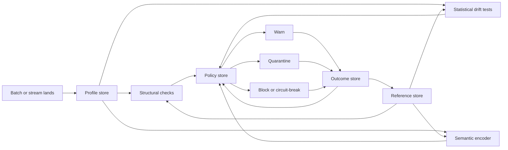
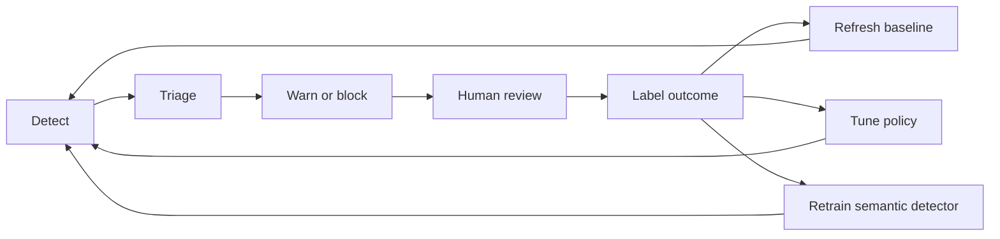

# AI-Powered Schema Drift Detection

## Executive Summary

Most native schema-drift monitors still focus on **physical drift**: columns added, removed, re-ordered, or type-changed. In product docs, entity["company","Soda","data quality company"] and entity["company","Monte Carlo","data observability company"] describe schema-change monitoring in exactly those terms; entity["company","WhyLabs","ai observability company"] adds inferred data-type change monitoring; and entity["company","Google","technology company"]'s TFDV focuses on descriptive statistics, inferred schema, anomalies, skew, and drift. That is necessary, but it does **not** fully address the nastier case where a column keeps the same name and physical datatype while its business meaning changes. For this report, I use **semantic schema drift** in that practical sense. citeturn8view7turn12view0turn8view2turn18view0turn8view4

The academic table-understanding literature is what closes that gap. *Sherlock* learns semantic type from column statistics and value embeddings, *Sato* adds table context, *Doduo* predicts column types and relations from the whole table, *TURL* learns structure-aware table representations, and *Pythagoras* extends semantic typing to numeric-heavy enterprise data lakes. The practical lesson for data engineering is not “replace schema checks with AI”; it is to build a **layered detector stack**: structural checks for loud breakages, statistical/profile checks for unusual behaviour, semantic models for column-meaning changes, and model-aware or downstream canaries so systems fail loudly before dashboards and ML features are silently corrupted. citeturn17view1turn16view0turn17view0turn17view2turn14search2turn19view0

## Why Semantic Drift Is Hard

A semantic drift issue can look deceptively healthy at the storage layer: `amount` quietly flips from rupees to paise, `status` changes from payment state to fulfilment state, or `country` becomes billing country instead of shipping country. A parser still sees `DECIMAL` or `STRING`, so structural contracts pass. The hard part is that **meaning lives in the values, neighbouring columns, and table context**, not just in the header. That is exactly what the semantic-type papers show: header-only, dictionary-only, or regex-only approaches are brittle, especially on dirty data or missing metadata, while context-aware models perform materially better. TFDV reinforces the same point from another angle: it can compute semantic-domain statistics and sliced profiles, but its inferred schema is intentionally conservative and expected to be reviewed with domain knowledge. citeturn17view1turn16view0turn17view0turn17view2turn18view0turn18view1

This matters because silent corruption is more common than dramatic breakage. The dataset-shift literature explicitly warns that ML systems tend to **fail silently** unless they are instrumented to detect unexpected inputs and quantify whether those shifts are harmful. The data-engineering equivalent is a pipeline that stays green while downstream marts, KPIs, and model features quietly drift away from what the business thinks they mean. citeturn19view0

## Detection Methods

A production design should combine cheap profile signals with richer context models. Deequ supports anomaly detection on stored metric history in a `MetricsRepository`; TFDV compares dataset statistics against schemas and drift/skew comparators; Soda exposes schema-evolution plus statistical distribution checks; WhyLabs compares profiles to reference baselines using distance algorithms such as Hellinger, KS, and KL; and Monte Carlo adds PSI, KS, JS divergence, and new/missing-value cardinality metrics for ML-facing drift detection. The matrix below is a practical synthesis of those sources plus the semantic-type literature; the **compute-cost** column is an engineering estimate rather than a vendor-quoted benchmark. citeturn8view3turn8view4turn8view8turn8view2turn8view5turn10view2turn16view0turn17view1turn17view0turn17view2turn14search2

| Detection method | Signal type | Pros | Cons | Compute cost | Typical use cases |
|---|---|---|---|---|---|
| Statistical | Row count, null ratio, distinct count, new/missing categories, PSI, KS, JS, Hellinger, inferred type/domain anomalies | Cheap, explainable, easy to run on profiles or metadata, good first line of defence | Misses meaning changes when values remain “plausible”; weak on context | Low to medium | Volume drops, enum changes, null spikes, distribution shifts, unexpected type/domain movement |
| Embedding and semantic | Column embedding from header + sampled values + neighbouring columns + metadata; semantic-type label; relation predictions | Best fit for same-name/same-type meaning changes; handles messy headers; captures context | Heavier to train/serve, weaker explainability than simple stats, sparse columns can be noisy | Medium to high | Repurposed columns, unit changes, ontology mapping, semantic typing, context-dependent column meaning |
| Model-aware | Input/output drift, feature-level canaries, accuracy/precision/recall/F1, regression error, comparison/validation failures | Tells you whether the drift is actually harmful downstream; best “last line of defence” | Often later than structural/statistical detectors; only works where downstream KPI/model/canary exists | Medium to high | ML feature tables, core marts, revenue/compliance dashboards, silent corruption detection |

Two implementation details are especially important. First, semantic detectors work best when the representation includes **header text, sampled values, neighbouring columns, and table relations**; that is the common thread running through Sherlock, Sato, Doduo, and TURL. Second, numeric-heavy enterprise columns need special handling; Pythagoras is a useful reminder that text-first semantic detectors leave a real blind spot in production data lakes. citeturn17view1turn16view0turn17view0turn17view2turn14search2

## Architecture Pattern

The cleanest operating model is a **four-store pattern**. A **profile store** keeps compact statistics and sketches; a **reference store** keeps approved baselines and semantic fingerprints; a **policy store** converts scores into warn/block/quarantine decisions; and an **outcome store** records whether each alert was a true issue, an expected change, or detector noise. whylogs and TFDV are natural fits for the profile layer, WhyLabs reference profiles for the baseline layer, Deequ’s `MetricsRepository` for historical metric comparison, and Monte Carlo or WhyLabs controls for the policy layer. The outcome store is the part many teams skip, even though it is what turns “anomaly detection” into an improving reliability system. citeturn10view1turn10view2turn18view0turn8view1turn8view3turn10view0turn13view0



A feedback loop is not optional. Monte Carlo explicitly lets teams widen or narrow thresholds through sensitivity, mark anomalous periods as normal, and exclude periods from training; WhyLabs similarly revolves monitors around baselines, actions, and historical analysis. Operationally, that means reviewers should label alerts, baseline windows should be versioned, and promotion from **shadow** to **blocking** should depend on **precision**, **recall on seeded incidents**, **detection delay**, and **false alarm rate**. Concept-drift work consistently notes the trade-off between fast detection and false alarms, so tuning is part of the design, not a cleanup step. citeturn13view0turn10view0turn10view1turn6search0turn6search16turn15search22



## Practical Snippets

The warehouse-friendly pattern is to compute cheap profile features per batch and per slice in SQL, then combine them with semantic-model scores and downstream canaries in application code or in the observability control plane. TFDV’s slicing pattern, Monte Carlo’s segmentation and cardinality support, and the table-context papers all point in that direction. citeturn18view1turn8view5turn8view6turn17view0turn17view2

```sql
-- Example: populate a profile store for a critical column, by slice
-- Adapt function names to your warehouse.

with current_batch as (
    select
        batch_date,
        country,
        payment_status
    from mart.orders
    where batch_date = current_date
)
select
    batch_date,
    country,
    count(*) as row_count,
    avg(case when payment_status is null then 1.0 else 0.0 end) as null_ratio,
    approx_count_distinct(payment_status) as distinct_count,
    min(length(payment_status)) as min_len,
    max(length(payment_status)) as max_len
from current_batch
group by 1, 2;
```

```python
# Layered semantic schema drift detector

def detect_semantic_schema_drift(column_name, batch_df, reference):
    structural = diff_schema(batch_df.schema, reference.physical_schema)

    profile = build_profile(
        batch_df[column_name],
        slices=["country", "source_system"]
    )
    statistical = {
        "null_ratio_shift": compare(profile.null_ratio, reference.null_ratio_band),
        "distinct_shift": compare(profile.distinct_count, reference.distinct_band),
        "dist_shift": psi_ks_js(profile.histogram, reference.histogram),
        "new_missing_values": compare_sets(profile.distinct_values, reference.distinct_values),
    }

    semantic_input = {
        "header": column_name,
        "sample_values": sample_values(batch_df[column_name], n=64),
        "neighbor_columns": neighbor_column_names(batch_df),
        "metadata": reference.metadata,        # descriptions, lineage, dbt docs, ontology tags
    }
    current_embedding = encode_column_semantics(semantic_input)
    semantic_distance = cosine_distance(current_embedding, reference.embedding)
    current_label = predict_semantic_label(semantic_input)

    downstream = run_canaries(reference.downstream_assets)
    high_risk = downstream.failed or current_label != reference.expected_label

    severity = policy_engine(
        structural=structural,
        statistical=statistical,
        semantic_distance=semantic_distance,
        semantic_label=current_label,
        downstream=downstream,
        criticality=reference.criticality
    )

    write_outcome(
        column=column_name,
        severity=severity,
        structural=structural,
        statistical=statistical,
        semantic_distance=semantic_distance,
        semantic_label=current_label,
        downstream=downstream
    )

    return severity
```

A strong policy is to escalate only when signals agree. In practice, a semantic alert is far more trustworthy when embedding distance rises **and** distinct values change, **or** a downstream validation/comparison canary also moves. That is the difference between a research demo and a detector that actually prevents silent downstream corruption. citeturn8view5turn12view0turn9view0turn19view0

## Pitfalls and Best Practices

The most common mistakes are treating semantic drift as only a type-change problem, using generic text embeddings without table context, training on polluted baseline windows, and never closing the loop on alert outcomes. The research side shows that context materially improves semantic typing, while newer work on linguistic drift warns that off-the-shelf embeddings are not always ideal for isolating interpretable semantic change. The product side shows the operational analogue: baseline selection, exclusion windows, and threshold tuning are not optional details but core controls. citeturn16view0turn17view0turn17view2turn2search14turn13view0turn8view1turn10view0

The best practice stack is straightforward. Start with column-level profiles for every critical asset. Add semantic fingerprints only for columns whose meaning materially affects joins, metrics, or ML features. Segment profiles by source, market, or business slice whenever behaviour is not globally uniform. Put model-aware or validation canaries on the downstream marts that matter most. For high-risk tables, prefer fail-closed actions such as quarantine or circuit-breaking over alert-only workflows. Silent corruption is usually costlier than a controlled stop. citeturn9view0turn12view0turn10view0turn19view0

> Start with cheap profiles and strong baselines, then add semantic embeddings only where meaning drift is genuinely costly.  
> If a column powers revenue, compliance, or model features, pair semantic detection with at least one downstream canary so the system can fail loudly instead of drifting quietly.

citeturn10view1turn13view0turn19view0
