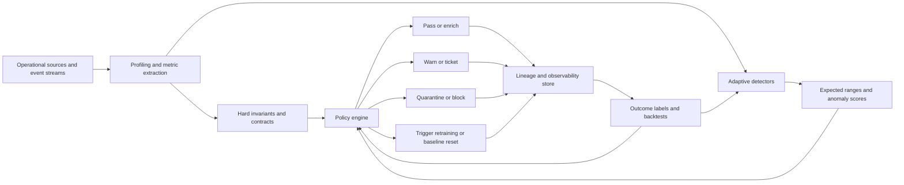
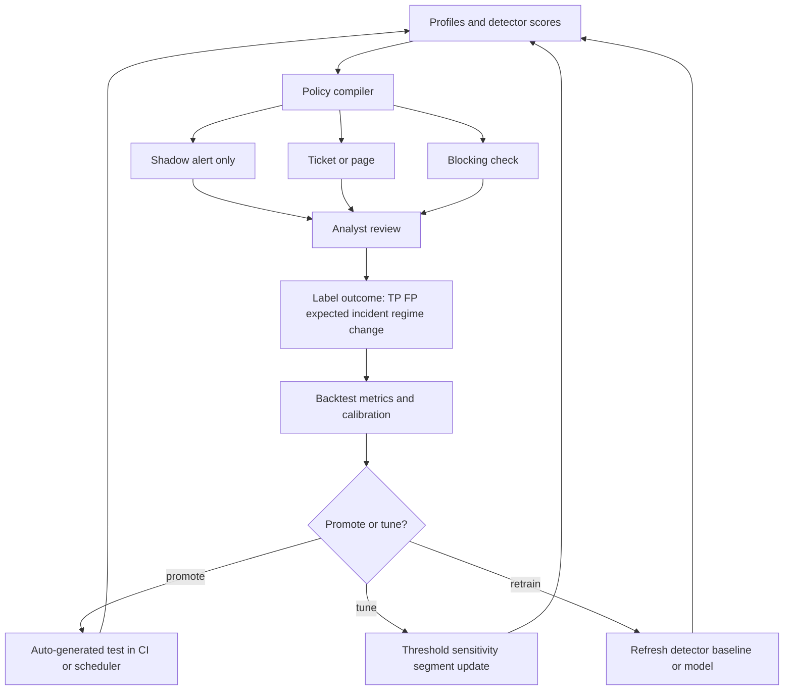
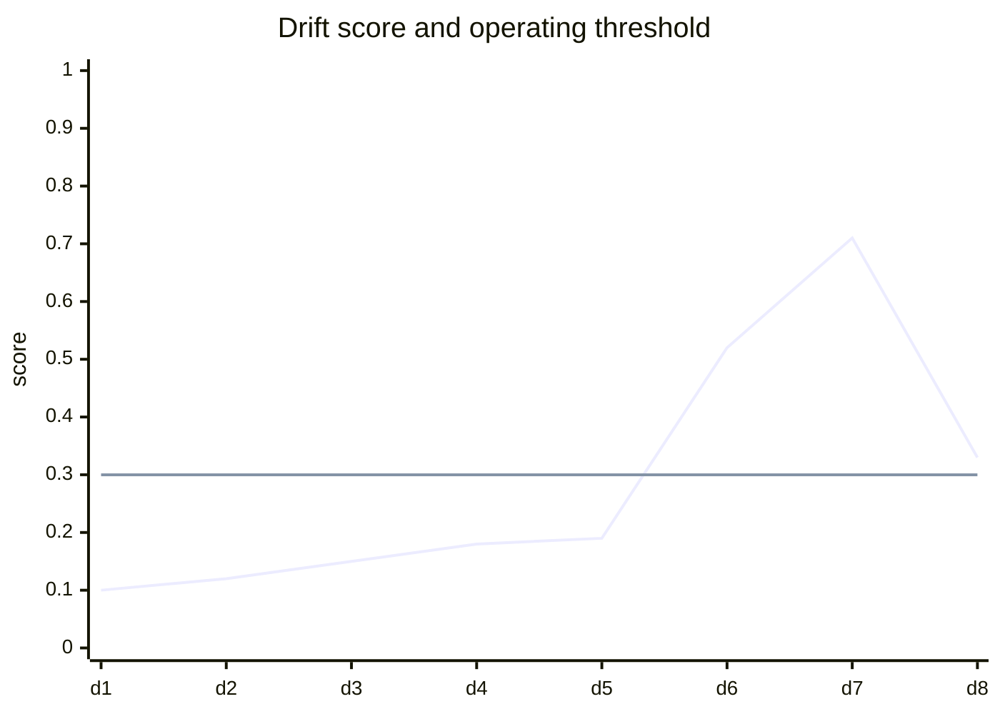
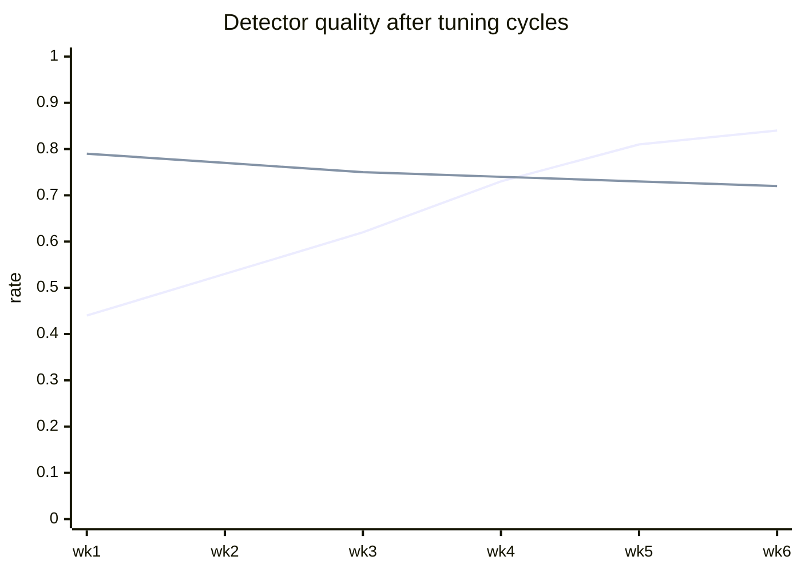

# Adaptive Data Quality

## Executive summary

Replacing static `null/not null` checks with adaptive models does **not** mean abandoning rules. The strongest operating model is a **three-layer system**: hard invariants for impossible states and regulatory requirements, adaptive expectation models for metrics that naturally vary over time, and policy logic that decides whether a deviation should warn, page, block, quarantine, or retrain. That architecture is visible across production systems and docs from Google’s TFDV, Deequ, Amazon SageMaker Model Monitor, GX Cloud, Soda, WhyLabs, Monte Carlo, and Anomalo. 
The core taxonomy matters. **Data drift** usually means a change in the input distribution \(P(X)\); **label shift** means \(P(y)\) changes; **concept drift** means the relationship \(P(y \mid X)\) changes. Static rules catch schema faults and impossible values. Statistical tests catch marginal distribution shifts. Streaming drift detectors catch change points quickly. Unsupervised anomaly detectors catch unknown unknowns. None of these is sufficient on its own. Surveys and empirical studies consistently show that monitoring needs a mix of detectors, backtesting, and explanation tools. 
For the specific problem of replacing rigid completeness checks, the practical pattern is to convert “column X must be non-null” into **missingness-rate monitoring** over time, segmented by source, table, partition, customer cohort, or business calendar. Keep absolute non-null constraints only for primary identifiers, legal fields, and truly impossible conditions. Everywhere else, learn an expected range for null ratio, row count, distinct count, freshness, quantiles, and categorical mix, then clip those learned expectations with manually defined “valid ranges” so the model never normalises nonsense. Soda’s separation of learned **expected range** from manual **valid range**, GX Cloud’s dynamic parameters, and Monte Carlo’s automated thresholds all implement this hybrid idea explicitly. 

Evaluation must move beyond “did drift fire?” The right operating metrics are incident precision, seeded-incident recall, detection delay, false alarm rate, calibration of detector probabilities or confidence bands, and business-weighted utility. The literature on streaming evaluation stresses the trade-off between detection delay and false alarms, while NannyML’s performance-estimation methods show that badly calibrated probabilities can make downstream monitoring unreliable even when the detector itself “works.” 

No programming language or cloud provider was specified, so the design patterns below are intentionally language- and cloud-agnostic. Code snippets are pseudocode with Python-like syntax only for readability.

## Definitions and taxonomy

Static data-quality rules are deterministic assertions such as “field exists,” “column type is integer,” “row count > 0,” or “customer_id is never null.” They are excellent for schema contracts, keys, bounded business logic, and compliance controls. Deequ describes this style as “unit tests for data,” while TFDV automates schema generation and anomaly detection against expectations learned from training data. These approaches are foundational, but by design they struggle with seasonality, segment-specific behaviour, gradual population changes, and context-dependent completeness.
A useful taxonomy for adaptive data quality has five families.

**Static rule engines** check invariants and contracts. Examples include Deequ, TFDV, GX, and Soda tests. They are best where the business meaning is crisp and failure should be immediate. 
**Statistical drift tests** compare a reference and current sample using methods such as KS, chi-square, PSI, Wasserstein, Jensen–Shannon, KL, or MMD. Evidently documents a broad menu of drift methods and automatic method selection by data type and sample regime; Soda distribution checks explicitly expose KS, chi-square, PSI, and standardised Wasserstein options. Gretton’s MMD paper gives the classic kernel two-sample-test foundation for nonparametric comparison. 
**Streaming drift detectors** monitor a live series and raise a change-point signal without needing a full batch reference every time. DDM tracks error-rate changes, while ADWIN keeps a variable-length window with statistical guarantees and KSWIN applies KS-style windowing. River packages ADWIN, KSWIN, and Page-Hinkley in a streaming-friendly API. These are most useful when latency matters more than exhaustive explanation. 

**Unsupervised anomaly detection** scores unusual records, windows, or table-level metric vectors without labels. Isolation Forest isolates rare points efficiently; LOF scores local density deviations; one-class SVM estimates the support of a “normal” region. This family is valuable for unknown failure modes, multivariate changes, and sparse incidents that simple marginal tests miss. 
**Model-aware post-deployment monitors** estimate or decompose model-performance change. NannyML distinguishes data drift from concept drift, offers univariate and multivariate drift detection, estimates model performance without targets through CBPE and DLE, and isolates concept-drift impact with Reverse Concept Drift. This matters because a large covariate shift can be harmless, and a small covariate shift can be very harmful. 
The distinction between data drift and concept drift is especially important. The classic concept-drift survey defines concept drift primarily as a supervised setting where the relation between inputs and target changes over time, while NannyML’s docs separate covariate shift \(P(X)\) from concept drift \(P(y \mid X)\) and note that both can appear simultaneously. Data-quality platforms often detect the first but not the second. That is why “distribution drift” should not be treated as a synonym for “model degradation.” 
A final practical taxonomy is by **granularity**. Modern programmes monitor at least four levels: table-level signals such as freshness and volume, column-level signals such as missingness and quantiles, relationship-level signals such as join-cardinality and reconciliation, and business/semantic metrics such as revenue, conversion, fraud rate, or approval rate. Adaptive systems usually begin at the first two levels because they are cheap and explainable, then add relationship and KPI layers once baseline governance is stable. 

## Architectures for adaptive data quality pipelines

The reference architecture for adaptive data quality is a **profile-first, policy-driven pipeline**. It ingests raw batch or stream data, computes compact profiles and monitorable metrics, applies hard invariants immediately, scores adaptive detectors against baselines or expected ranges, and sends the combined result into an action engine that decides whether to pass, warn, block, quarantine, or retrain. TFDV and whylogs both emphasise scalable statistics/profiles; Monte Carlo, Soda, GX Cloud, and WhyLabs all expose policy and alerting layers on top of those signals. 



A rigorous implementation usually separates four stores.

The **reference store** holds training, validation, or approved production baselines. WhyLabs uses reference profiles explicitly as baselines for monitoring, and SageMaker Model Monitor likewise compares live traffic to a baseline extracted from training data. 

The **profile store** holds summary statistics rather than raw records. whylogs profiles and TFDV statistics are examples. This is attractive because it compresses compute cost and reduces the need to move raw sensitive data into every downstream monitoring tool. 

The **policy store** maps scores to actions. Monte Carlo’s automated thresholds, GX Cloud’s incident management and alerting, and Soda’s learned expected ranges plus valid ranges are all examples of policies layered on top of detection signals rather than embedded inside the detector itself. 

The **outcome store** records whether an alert was true positive, false positive, expected business event, data-source reconfiguration, or drift that required retraining. Without this store, you cannot compute precision, delay, or calibration, and your “adaptive” system will remain permanently uncalibrated. WhyLabs’ preview/backfill flow and LinkedIn’s separation of detection from notification both point in this direction operationally.
For replacing `null/not null`, the most effective transformation is:

1. **Keep hard non-null only for true invariants** such as primary keys, required legal fields, partition columns, and CDC metadata.
2. **Convert all other completeness checks into time-series signals**: missing ratio, longest null streak, missingness by segment, and joint missingness across related columns.
3. **Feed those signals to adaptive detectors** with context such as weekday, partition, source system, partner, or campaign.
4. **Clip learned bands with hard valid ranges** so the model never accepts impossible values, as Soda recommends. 

A practical pseudocode sketch looks like this:

```python
# hard invariants + adaptive completeness checks
profiles = profile(batch)                       # row_count, null_ratio, quantiles, category_mix, freshness
context = {
    "source": batch.source,
    "partition": batch.partition_date,
    "segment": batch.business_segment,
    "calendar": batch.calendar_features
}

for column in monitored_columns:
    observed = profiles[column].null_ratio
    hard_fail = (column in truly_non_null_fields) and (observed > 0.0)

    band = completeness_model[column].predict_interval(context=context)
    soft_anomaly = (observed < band.low) or (observed > band.high)

    result = {
        "column": column,
        "observed": observed,
        "expected_low": band.low,
        "expected_high": band.high,
        "severity": "fail" if hard_fail else ("warn" if soft_anomaly else "pass"),
        "contributors": explain_shift(column, profiles, context)
    }

    emit_test_result(result)
```

That pattern is consistent with GX Cloud’s dynamic parameters, Monte Carlo’s ML thresholds, and Soda’s expected-range model.
## Feedback loops and evaluation

Adaptive data quality only becomes reliable when detector output feeds back into **tests, alerting, and model tuning**. The cleanest design is to treat the detector as a scoring service and the test layer as a compiler. The detector emits a score, expected band, confidence, and top contributors. A policy engine then compiles that into concrete test outcomes such as “warn,” “fail,” “page,” or “quarantine,” while also writing every decision to an incident/outcome store. LinkedIn’s ThirdEye explicitly separates anomaly-detection flow from notification flow to reduce noise and give teams control over routing and suppression. citeturn17search0



The feedback loop should ingest at least five types of outcome signal: analyst triage labels, downstream dashboard or model failures, deployment/change events, source-system incidents, and business-calendar annotations. Without deployment and calendar context, the system will learn to page on launches, month-end closes, and legitimate seasonality. Monte Carlo’s sensitivity settings, WhyLabs’ preview mode, and LinkedIn’s suppression rules all exist because these contextual signals materially reduce false alarms. 

A strong evaluation harness should support **backtesting on historical incidents**, **seeded synthetic drifts**, and **shadow deployment** before any detector is allowed to block pipelines. Gama et al. show that drift evaluation must consider detection delay and false alarms explicitly, and that tuning the threshold trades one against the other. NannyML’s CBPE further shows that if your probabilities are not calibrated, downstream performance estimation can become biased. 
The most useful visualisations are time-series overlays of detector score against threshold, followed by quality curves for precision and recall after each tuning cycle. The charts below are **illustrative Mermaid templates** you can wire to your monitoring store.





The table below gives **starting operating thresholds**. These are **recommendations**, not universal constants. They are inferred from the documented trade-offs in stream-learning evaluation, calibration theory, and production alert-tuning workflows, and should be tuned on your own backtests. 

| Metric | Why it matters | Recommended starting threshold | How to use it | Support |
|---|---|---:|---|---|
| Incident precision | Controls alert fatigue and whether detectors can page humans | **≥ 0.80** for paging or auto-ticketing; **0.60–0.80** for chat-only shadow alerting | Do not let adaptive detectors page until backtests clear the higher bar | Production alerting systems emphasise noise reduction and preview/tuning before hard routing. citeturn17search0turn25view4turn21view7 |
| Seeded-incident recall | Ensures learned monitors still catch historically important failures | **≥ 0.70** before replacing an existing static rule; **≥ 0.90** for regulated or revenue-critical tables | Seed known incidents and synthetic shifts; compare against prior rules | Stream-evaluation papers and detector benchmarks use recall/true-detection probability as a core criterion. citeturn28search4turn28search13turn29view1 |
| Detection delay | Measures time-to-awareness after drift occurs | **< 1 pipeline interval** for blocking controls; **< 3 intervals** otherwise | Compute from ground-truth incident start to first valid alarm | Delay is a first-class criterion in drift-detection evaluation. citeturn29view1turn28search13 |
| False alarm rate | Captures operational noise directly | **< 5% of monitor runs** or **< 1 page per on-call rotation per week** for any single detector family | Report both per-run and per-incident FAR | Threshold tuning explicitly trades off false alarms and delay. citeturn29view1 |
| Calibration error | Needed if you use detector confidence or model-score-based estimators | **ECE < 0.02** ideal; **ECE < 0.05** acceptable starting bar | Recalibrate with isotonic or temperature scaling if worse | NannyML documents calibration as a requirement for reliable performance estimation and uses ECE during calibration checks. citeturn29view0turn20view3 |
| Dataset drift share | Converts many column-level tests into one dataset-level decision | Start at **0.50** drifting columns; raise toward **0.70** on very wide tables to reduce noise | Tune separately for “warn” and “fail” severities | Evidently defaults dataset drift share to 0.5 and documents 0.7 as a custom operating point. 

A simple backtest harness can be written like this:

```python
def evaluate_detector(events, labels, max_delay):
    # labels: incident windows with known start/end and severity
    tp = fp = fn = 0
    delays = []

    for incident in labels:
        fired = first_alarm_within(events, incident.start, incident.start + max_delay, detector=incident.detector)
        if fired:
            tp += 1
            delays.append(fired.timestamp - incident.start)
        else:
            fn += 1

    for alarm in events:
        if not overlaps_any_incident(alarm, labels, max_delay):
            fp += 1

    precision = tp / max(tp + fp, 1)
    recall = tp / max(tp + fn, 1)
    far = fp / max(len(events), 1)
    mean_delay = mean(delays) if delays else None
    return precision, recall, far, mean_delay
```

## Tools and ecosystem

The ecosystem now splits into three broad camps: **rule-first libraries** for contracts and static assertions, **monitoring-first libraries** for drift and post-deployment analysis, and **commercial control planes** that combine learned thresholds, lineage, routing, and incident workflows. The most robust programmes usually combine one tool from the first camp with one from the second or third. 
The table below is a **representative comparison**, not an exhaustive market map.

| Tool | Type | Adaptive capability | Best fit | Integrations / constraints | Maturity view | Evidence |
|---|---|---|---|---|---|---|
| Deequ | OSS library | Static data unit tests, metrics repository, anomaly detection on data-quality metrics over time | Large Spark estates that want rules plus metric-history-driven anomaly checks | Spark-centric; strong for batch pipelines and repository-backed history | Mature OSS for Spark-heavy teams; less natural for non-Spark stacks | |
| TFDV | OSS library | Scalable statistics, schema generation, skew/anomaly detection against reference data | ML pipelines already using TFX-style workflows | Strong TensorFlow/TFX affinity; current docs note active releases and broad production use at Google | Mature and battle-tested in ML pipelines |  |
| Evidently | OSS library | Automatic drift-method selection, 20+ drift methods, test conditions generated from reference data | Batch validation, notebooks, CI, lightweight monitoring services | In-memory processing; docs recommend sampling very large datasets | Mature library for batch and CI; not a full control plane by itself | |
| NannyML | OSS library plus cloud | Univariate/multivariate drift, CBPE, DLE, RCD for concept-drift impact | Teams needing post-deployment analysis when labels lag | Strongest on model-aware monitoring; depends on calibration and method assumptions | Specialized and technically strong; narrower than enterprise data-observability suites |  |
| whylogs + entity["company","WhyLabs","ai observability company"] | OSS profiling + commercial platform | Profile-based drift, data-quality constraints, reference-profile baselines, preview/backfill tuning | Privacy-sensitive environments and teams that want summaries instead of full raw-data movement | Profiles are statistical summaries; commercial layer adds monitors, dashboards, alerts | Strong hybrid model; good fit for profile-first architectures |  |
| GX Cloud from entity["company","Great Expectations","data quality company"] | Open core / commercial | Anomaly Detection Expectations, dynamic parameters, scheduled validations, alerting, incidents | Organisations already invested in expectations-as-code but wanting adaptive ranges and workflow features | Strong governance workflow; adaptive checks depend on supported sources | Strong for combining contracts with adaptive expectations |  |
| entity["company","Soda","data quality company"] | Open core / commercial | YAML tests, observability monitors, learned expected ranges, data contracts | Data teams that want tests plus observability plus contracts in one framework | Distribution checks in v3 are being deprecated in favour of newer monitoring; expected vs valid range design is strong | Good open-core option, especially for contracts + monitors |  |
| entity["company","Monte Carlo","data observability company"] | Commercial | ML-powered automated thresholds, monitor segmentation, backfill, monitors as code, lineage support | Enterprise observability programmes with many tables and routing needs | Strong warehouse integrations; docs show broad Snowflake monitor/lineage coverage | Mature enterprise control plane for learned thresholds + incidents |  |
| entity["company","Anomalo","data quality company"] | Commercial | Unsupervised ML, automatic secondary checks to reduce false positives, no-code validation rules, root-cause views | Enterprises prioritising automated discovery of unknown issues | Strong integration surface and no-code workflow; vendor emphasises large-scale monitoring and root-cause analysis | Mature commercial platform with strong automation story | 
Another commercial option worth noting is Bigeye, whose docs expose **autothresholds**, **constant thresholds**, **relative thresholds**, **no thresholds**, and **freshness schedule thresholds**. That is a useful middle ground between fully manual and fully learned monitoring, although the public docs are less explicit than Monte Carlo’s or Anomalo’s about multistep feedback-loop design. citeturn20view9

A concise selection rule works well in practice. Use Deequ or TFDV when your highest-value problems are **contracts, schemas, and large-batch validation**. Use Evidently or NannyML when you need **custom evaluators, research flexibility, or model-aware monitoring**. Use GX or Soda when you need **tests plus workflow and governance**. Use WhyLabs, Monte Carlo, or Anomalo when you need a **full control plane** with learned thresholds, routing, and operational UX. 

## Empirical evidence, benefits, and pitfalls

The most convincing evidence that adaptive data quality is worthwhile comes from production systems rather than pure benchmarks. At entity["company","Google","technology company"], the TFDV paper reports production deployment inside TFX and use by hundreds of product teams to monitor and validate several petabytes of production data per day. The paper explicitly reports tangible benefits: earlier error detection, model-quality improvements from better data, engineering-hour savings during debugging, and stronger data-centric workflows. That is one of the clearest primary-source arguments for integrating adaptive validation directly into ML/data pipelines. 

The 2024 “Adaptive Data Quality Scoring Operations Framework” paper is especially relevant to your question because it studies a drift-aware mechanism specifically for adaptive data-quality scoring. It argues that fixed retraining windows are inefficient when data-quality characteristics evolve, and reports that drift-triggered adaptation improved quality-scoring performance while reducing runtime. In the reported experiments, end-of-run MAE reached 0.112 and \(R^2\) 0.978 in one adaptive setting, while the adaptive approach also achieved an 88% processing-time reduction versus the standard scoring approach in the reported comparison. The important lesson is not the exact numbers but the pattern: **event-triggered adaptation can preserve quality while materially reducing wasted retraining/analysis cost**. 

For detector choice, Rabanser, Günnemann, and Lipton’s “Failing Loudly” remains one of the best practical empirical references. Across the explored dataset shifts in their study, a two-sample-testing approach with pretrained-classifier dimensionality reduction performed best, while domain-discriminating approaches were useful for qualitative characterisation and harmfulness analysis. The implication for adaptive data quality is that **compressed representations plus simple statistical tests can outperform more elaborate raw-space comparisons**, especially when dimensionality is high. 

At entity["company","Amazon","technology company"], SageMaker Model Monitor shows another pragmatic pattern. The service combines baseline-driven rules, multiple monitoring dimensions, CloudWatch-style alerting, and hooks for custom pre/post-processing. In the paper’s bias-drift case study, once about 10% of the data was observed, the alarm-raising procedure was reported as almost always 100% accurate in the simulated scenarios, and even at roughly 1% of samples the reported accuracy remained above 80% in high-bias or no-bias cases. The takeaway is that **you do not always need full-volume data to make reliable drift decisions**, provided your sampling and baselining are well designed. 

At entity["company","LinkedIn","professional network company"], ThirdEye’s engineering write-up shows why many adaptive systems fail operationally even when the algorithms are sound. The hard problem was not merely “detect anomalies” but “detect the right anomalies and send the right notifications.” Their solution separated detection flow from notification flow, added dimension exploration, anomaly filtering, merging, grouping, suppression, and channel-specific routing. This is the best evidence that **feedback-loop design and policying are as important as the detector itself**. 

At entity["company","Airbnb","travel platform company"], Chronon demonstrates the value of embedding adaptive quality monitoring inside the feature platform itself. Airbnb’s public page highlights automated feature monitoring that can auto-generate monitoring pipelines for training-data quality, training-serving skew, and feature drift. That is a strong architectural signal: if your organisation already has a feature store or semantic layer, adaptive data quality belongs *inside* it, not bolted on later. citeturn19view5

Vendor-published customer numbers also suggest that the upside can be large, though they should be treated as directional rather than independent benchmarks. Anomalo’s public materials claim that ADP expanded from roughly 700 manual checks to more than 16,000 ML-powered validations, Afterpay addressed about 30% more data-related questions in self-serve mode, and Included Health established alerting for 791 datasets. They are useful illustrations of possible operating leverage, but they are not substitutes for peer-reviewed comparative studies. 

The main pitfalls recur across sources.

The first is **alert fatigue**. LinkedIn had to build merger, grouping, filtering, and suppression; WhyLabs added preview and backfill for tuning; Anomalo advertises secondary checks to weed out false positives. A detector with high theoretical power but poor routing will fail in production. 
The second is **baseline staleness**. Bayram et al. explicitly motivate drift-triggered adaptation because fixed retraining windows waste compute and miss real regime shifts. WhyLabs and SageMaker both depend on baseline/profile choices, which means a stale reference can either over-alert or under-alert. 
The third is **confusing data drift with concept drift**. NannyML’s documentation makes the distinction explicit, and its PAPE/CBPE materials also show that some targetless estimators depend on assumptions like calibration or absence of concept drift. If you monitor only feature distributions, you can still miss real model failure. 

The fourth is **cost explosion from naive full scans**. Evidently processes data in-memory and recommends sampling for very large datasets; Deequ and TFDV push computation into scalable batch engines; WhyLabs uses compact profiles. Profile-first architectures are not just elegant, they are economically necessary. 
The fifth is **governance drift**: monitors exist but nobody owns them, severity rules conflict, or incidents are not tied to lineage and ticketing. GX Cloud’s user management, alerting, and incident workflows, Soda’s contracts, and Monte Carlo’s monitor/lineage model all recognise that adaptive quality is partly an organisational design problem. citeturn19view8turn19view7turn25view1

## Best practices and phased adoption roadmap

A few best practices are robust across tool choices.

Keep **hard rules for impossibilities** and use adaptive models for expected variability. Primary keys, partition identifiers, legal fields, and data-type constraints should stay deterministic. Missingness on optional fields, seasonally varying row counts, or category-mix drift should be learned. This is the single most important design principle. 
Monitor **metrics, not raw tables alone**. Adaptive systems perform better when fed stable, interpretable signals such as null ratio, freshness, distinct count, entropy, quantiles, join-cardinality, and semantic KPI values rather than only whole-table comparisons. That also makes explanations more actionable. 
Use **segmentation aggressively**. A global row-count detector often misses regional, customer-tier, or product-line faults. LinkedIn’s dimension exploration, Monte Carlo’s segmentation, and business-metric monitoring all point to the same lesson: drift should usually be learned per meaningful slice, not only on the aggregate. 

Separate **detector logic from policy logic**. The detector should say “how abnormal is this and why”; the policy engine should say “what do we do.” That makes it possible to tune severity, suppress known events, and promote detectors from shadow mode to blocking mode without retraining the detector itself. 
Use **preview and shadow modes** before paging or blocking. WhyLabs’ ad-hoc preview, LinkedIn’s alert preview, and Bayram’s drift-triggered adaptation results all support a promote-by-evidence approach rather than “ship and hope.” 
Treat **calibration as part of monitoring**, not as a one-time model-quality exercise. If you use probabilistic anomaly scores, CBPE-style estimators, or confidence bands, track ECE or a similar metric and recalibrate periodically. 

For privacy and governance, prefer **summary profiles, read-only service accounts, lineage-aware routing, and in-environment execution where possible**. WhyLabs’ profile-based design, Monte Carlo’s service-user setup, GX Cloud’s access controls and incidents, and native/warehouse deployment patterns in commercial products all support this direction. 

A phased roadmap that works well in large organisations is:

1. **Stabilise the floor**  
   Inventory critical tables and KPIs, implement contracts and hard invariants, and store monitorable metrics historically. Do not begin with unsupervised models alone. Start with row count, freshness, schema, missingness ratio, distinct count, and top categorical proportions. citeturn20view10turn21view9turn21view2

2. **Shadow adaptive detectors**  
   Run adaptive missingness, distribution, and KPI detectors in parallel with existing static rules. Do not page. Instead, measure precision, recall, delay, and calibration from historical incidents and seeded drifts. Use dataset drift share and segment-level operating points to tune noise. 
3. **Compile learned outputs into explicit tests and routing rules**  
   Promote the highest-confidence detectors into warning-level tests first, then fail-level tests only when precision is consistently high. This is where you connect detectors to orchestration, ticketing, lineage, and quarantine/backfill workflows. GX Cloud, Soda, and Monte Carlo are particularly strong patterns to emulate here. 
4. **Close the loop with labels and retraining**  
   Require analysts to label incidents, capture deployment/calendar context, and build automatic threshold tuning and model-refresh flows. Cap detector age with a maximum staleness window even if no drift fires, so your reference does not quietly rot. Bayram’s work is especially supportive of event-triggered adaptation, but practical operations still need a backstop cadence. 

5. **Extend from marginal drift to relational and business impact monitoring**  
   Once table and column signals are stable, add join reconciliation, cross-table comparison, semantic metrics, and model-aware measures such as delayed-ground-truth performance or RCD-style concept-drift impact estimation. This is where adaptive data quality stops being a dashboard and becomes a reliability system. 
## Open questions and limitations

The biggest unresolved technical issue is still **unsupervised concept drift**. The 2024 survey by Hinder et al. argues that the unsupervised setting is highly relevant for monitoring and anomaly detection, but still under-systematised compared with supervised drift research. In practice, many enterprise “adaptive quality” systems still detect \(P(X)\) changes far better than \(P(y \mid X)\) changes. 

A second open issue is **method selection under many simultaneous tests**. Public docs explain how to run PSI, JS, KL, KS, or learned thresholds, but fewer systems publish principled guidance for multiple-testing correction, per-segment thresholding, and cost-sensitive policy tuning across thousands of monitors. This remains a gap between academic drift detection and enterprise data observability. 

A third limitation is **evidence quality**. Primary papers and official docs are strong for algorithm mechanics and architecture, but customer impact numbers from vendors are often marketing claims rather than controlled external evaluations. Where I used such figures, they were identified as directional. Capabilities of commercial tools also evolve quickly, so feature comparisons based on public docs should be rechecked during procurement. 
The strongest conclusion, therefore, is straightforward: replace brittle `null/not null` checks **selectively**, not universally. Keep hard invariants where the business meaning is absolute. Everywhere else, learn expected behaviour from historical profiles, evaluate detectors with precision/recall/delay/calibration, and connect detector outputs to an explicit policy and feedback loop. That is the architecture most consistently supported by the literature and by production systems. 
